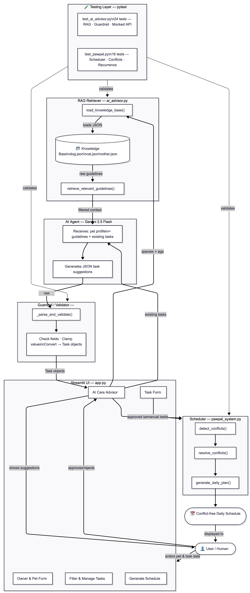

# PawPal+

A pet care scheduling web application powered by AI. PawPal+ helps pet owners organize daily care routines and receive personalized, AI-generated task suggestions based on veterinary guidelines.

---

## Base Project

The original project was **PawPal+**, a rule-based pet care task scheduler built with Python and Streamlit. Its original goals were to let a pet owner enter basic owner and pet information, manually schedule care tasks with priorities and durations, detect scheduling conflicts, and generate a conflict-free daily plan. The system had no AI integration — all logic was deterministic and fully manual.

---

## Title and Summary

**PawPal+** is a smart pet care assistant that combines structured task scheduling with an AI-powered care advisor. It matters because pet care is easy to forget or mismanage, especially for owners with multiple pets. The AI layer retrieves veterinary guidelines from a built-in knowledge base and uses them to suggest personalized daily care tasks — reducing the mental load on the owner while keeping suggestions grounded in real care standards.

---

## Architecture Overview

The system has four main layers:

1. **UI Layer** (`app.py`) — Streamlit interface where the user manages owners, pets, tasks, and interacts with the AI advisor.
2. **RAG Retriever** (`ai_advisor.py` + `knowledge_base/`) — Before calling the AI, the system retrieves relevant care guidelines from species-specific JSON files, filtered by the pet's age and weight. This grounds the AI's output in real veterinary data.
3. **AI Agent** (Gemini 2.5 Flash) — Receives the pet profile, retrieved guidelines, and existing tasks. Returns 3–5 structured task suggestions in JSON format, avoiding time conflicts with the current schedule.
4. **Guardrail / Validator** (`_parse_and_validate()`) — Parses and sanitizes the AI's JSON output before it becomes a `Task` object. Rejects malformed responses and clamps out-of-range values.
5. **Scheduler** (`pawpal_system.py`) — Handles conflict detection, conflict resolution, recurring tasks, and daily plan generation entirely through rule-based logic.




```
User → Streamlit UI → RAG Retriever → Knowledge Base
                                     ↓
                              AI Agent (Gemini)
                                     ↓
                         Guardrail / Validator
                                     ↓
                         Human Review & Approval
                                     ↓
                       Scheduler → Daily Schedule
```

Testing runs independently against all layers using mocked API calls.

---

## Video Walkthrough


---

## Setup Instructions

### 1. Clone the repository

```bash
git clone <your-repo-url>
cd applied-ai-system-project
```

### 2. Create and activate a virtual environment

```bash
python3 -m venv .venv
source .venv/bin/activate        # Windows: .venv\Scripts\activate
```

### 3. Install dependencies

```bash
pip install -r requirements.txt
```

### 4. Set up your API key

Get a free Gemini API key at **aistudio.google.com**.

```bash
cp .env.example .env
# Open .env and replace the placeholder with your key:
# GEMINI_API_KEY=your_key_here
```

### 5. Run the app

```bash
streamlit run app.py
```

Open **http://localhost:8501** in your browser.

### 6. Run the tests

```bash
python3 -m pytest tests/ -v
```

---

## Sample Interactions

### Example 1 — Senior dog (10 years, 5 lbs)

**Input:** Pet profile: Nina, dog, Chihuahua, 10 years old, 5 lbs, female. One existing task: Walking at 8:30 PM.

**AI Output (5 suggestions):**
```
✦ Feed Nina (senior formula, 1st meal)   — 7:00 AM · 15 min · High priority · daily
✦ Brush Nina's teeth                     — 8:00 AM · 10 min · Medium priority · daily
✦ Short gentle walk                      — 10:00 AM · 20 min · Medium priority · daily
✦ Feed Nina (senior formula, 2nd meal)   — 5:30 PM · 15 min · High priority · daily
✦ Joint supplement with evening meal     — 5:30 PM · 5 min  · High priority · daily
```
The AI correctly applied **senior dog guidelines** (smaller meals, joint supplements, shorter walks) retrieved from `dog.json`.

---

### Example 2 — Adult cat (3 years)

**Input:** Pet profile: Luna, cat, Tabby, 3 years old, 9 lbs, female. No existing tasks.

**AI Output (4 suggestions):**
```
✦ Morning feeding (dry food)    — 7:00 AM  · 10 min · High priority · daily
✦ Interactive play session      — 9:00 AM  · 15 min · Medium priority · daily
✦ Evening feeding               — 6:00 PM  · 10 min · High priority · daily
✦ Litter box cleaning           — 8:00 PM  · 10 min · Medium priority · daily
```
The AI applied **adult cat guidelines** — two meals, daily play, and litter maintenance — retrieved from `cat.json`.

---

### Example 3 — Conflict avoidance

**Input:** Same pet with existing task: "Vet appointment" at 9:00 AM for 60 minutes.

**AI Output:** Suggestions were scheduled around the blocked 9:00–10:00 AM slot — no AI suggestion overlapped with the existing vet appointment.

---

## Design Decisions

**Why RAG instead of a simple prompt?**
Prompting the AI with a generic "suggest tasks for my dog" produces vague, inconsistent results. By retrieving species- and age-specific guidelines first, the AI output is grounded in real veterinary care standards and produces consistent, appropriate suggestions.

**Why Gemini instead of a fine-tuned model?**
Fine-tuning requires a curated dataset of pet care task examples, which we don't have. Gemini with RAG achieves specialized behavior without training data — the knowledge base plays the role of domain expertise.

**Why a JSON guardrail?**
AI models occasionally return malformed output, especially under rate limits or edge cases. The `_parse_and_validate()` function ensures the app never crashes due to bad AI output — it either fixes the value (clamping priority to 1–3) or skips the item with a warning. This makes the system robust in production.

**Why require human approval for AI suggestions?**
AI suggestions are recommendations, not commands. The user reviews each suggestion before it enters the schedule. This keeps the human in control and prevents the AI from adding tasks that don't make sense for the owner's specific situation.

**Trade-offs:**
- No data persistence — all data is lost on page refresh. A SQLite database would fix this but was out of scope for this version.
- The knowledge base is hand-written JSON, not a vector database. This works for a small domain but would not scale to hundreds of documents.

---

## Testing Summary

### What was tested

| Test File | Tests | What It Covers |
|---|---|---|
| `tests/test_ai_advisor.py` | 24 | RAG loading, guideline retrieval by age, guardrail validation, API error handling, output consistency |
| `tests/test_pawpal.py` | 16 | Task completion, recurrence chaining, conflict detection, sorting, filtering |
| **Total** | **40** | **All 40 pass** |

### What worked well
- The guardrail tests caught multiple real edge cases during development: Claude/Gemini sometimes wraps JSON in markdown code fences (` ```json `), returns a single object instead of an array, or uses `"monthly"` as a recurrence value. All of these are now handled.
- Mocking the Gemini API in tests means the test suite runs in under 2 seconds and never requires an internet connection or API credits.

### What didn't work / limitations
- The UI (`app.py`) has no automated tests. End-to-end behavior (form interactions, session state) was tested manually.
- Early versions used `gemini-2.0-flash`, which had a quota limit of 0 on the free tier. Switching to `gemini-2.5-flash` resolved this, but required model discovery via the API's `list_models()` endpoint.

### What I learned
Writing tests for an AI module requires a different mindset than testing deterministic code. Since the AI output is unpredictable, tests focus on the *structure and safety* of the output rather than its exact content — verifying that the guardrail correctly handles bad inputs, not that the AI gives a specific answer.

---

## Reflection

### How I used AI during development

AI was used at multiple stages of this project. During **design**, I used it to think through the architecture — specifically whether RAG or a fine-tuned model was a better fit for a small, structured knowledge domain (RAG won because no training data was needed). During **implementation**, Gemini itself was the subject of debugging: reading API error logs to diagnose quota issues (`limit: 0` for `gemini-2.0-flash`) and calling `client.models.list()` to discover which models were actually available for the API key. During **prompt engineering**, I iterated on the system prompt until Gemini consistently returned a raw JSON array instead of prose with embedded JSON.

### One helpful and one flawed AI suggestion

**Helpful:** When given a detailed pet profile (species, age, weight) plus the retrieved senior dog guidelines, Gemini correctly suggested senior-appropriate tasks — smaller meals labeled "senior formula," joint supplements, and shorter walks — without being explicitly told what "senior" meant. This showed the RAG context was being used meaningfully.

**Flawed:** On several early runs, Gemini returned `"recurrence": "monthly"` for grooming tasks, which is not a valid value in the system (`"daily"`, `"weekly"`, or `null` are the only options). The model invented a plausible-sounding value that didn't match the schema. This is exactly why the guardrail exists — `_parse_and_validate()` catches this and sets it to `null` automatically. It was a clear reminder that AI models optimize for plausibility, not correctness.

### System limitations and future improvements

**Current limitations:**
- No data persistence — all pets and tasks are lost on page refresh. A SQLite database would fix this.
- The knowledge base is hand-written JSON with ~6 sections per species. It does not cover breed-specific conditions (e.g., hip dysplasia in large dogs) or individual medical history.
- The AI can only suggest tasks for today. It cannot reason about a week-long care plan.

**Future improvements:**
- Add a conversational AI chat so owners can ask questions like *"Is it normal for my senior dog to drink more water?"*
- Replace the rule-based RAG filter with vector embeddings for semantic retrieval across a larger knowledge base.
- Add email or push notifications for upcoming tasks.

### What this project taught me about AI and problem-solving

Building PawPal+ taught me that AI integration is less about the model and more about the layers around it. The model itself is a black box — what matters is what you feed it (RAG), how you validate what comes out (guardrail), and how you keep the human informed and in control (review step).

RAG shifted my thinking about what "intelligence" means in an AI system. The suggestions Gemini made for a 10-year-old senior dog were genuinely different from those for a 2-year-old adult dog — not because the model "knew" about dog care, but because it was given the right context. The intelligence was in the retrieval and prompt design, not just the model.

For a future employer: this project demonstrates the ability to integrate a production AI API, design a retrieval layer, write defensive validation code, and build a reliable test suite — all in a working, deployable application.
